[](https://minecraft.wiki/w/Java_Edition_1.21.1)
[](https://files.minecraftforge.net/net/minecraftforge/forge/index_1.21.1.html)
[](https://openjdk.org/projects/jdk/21/)
[](https://creativecommons.org/licenses/by-nc/4.0/)

# 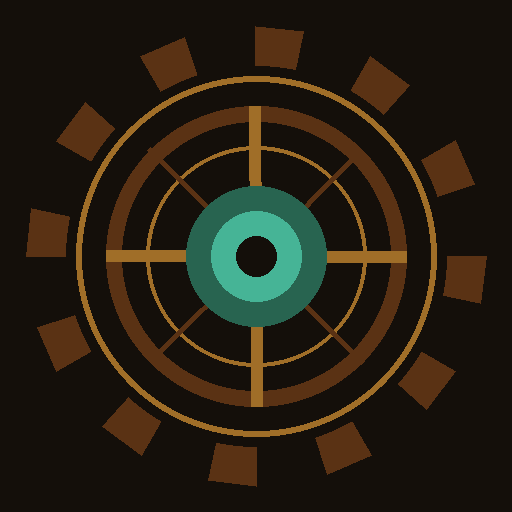 Antikythera: The Lost Mechanics
*A Minecraft 1.21.1 mod*

> *"The mechanism was too powerful. They broke it apart and hid it beneath the earth. But the automatons never stopped guarding it."*


## Prerequisites

The mod was developed with and requires:
- Minecraft 1.21.1
- Forge 52.1.0 or newer
- Java 21

---

## Installation Instructions

### Through the `.jar` file

First, download the latest `.jar` file from the [Releases](https://github.com/georgekrds/Antikythera-The-Lost-Mechanics/releases/tag/v1.0.0) page. Then, follow the instructions below depending on the launcher you use:

#### Option A: Official Minecraft Launcher
Place the downloaded `.jar` file in the `mods/` directory of your Minecraft Forge installation:
- **Windows:** `%AppData%\.minecraft\mods\`
- **macOS:** `~/Library/Application Support/minecraft/mods/`
- **Linux:** `~/.minecraft/mods/`

#### Option B: Custom Launchers (Prism, CurseForge, Modrinth, etc.)
1. Create a new instance/profile in your launcher for **Minecraft 1.21.1**.
2. Select **Forge (v52.1.0 or newer)** as the mod loader for that instance.
3. Open your instance's folder (usually by clicking "Open Folder" or "View Mods" inside your launcher).
4. Drop the downloaded `.jar` file into the `mods` folder.

### Through Gradle

**Step 1** — Clone the repository
```
git clone https://github.com/georgekrds/Antikythera-The-Lost-Mechanics/MOD
```
**Step 2** —  Navigate to the project folder
```
cd MOD
```
**Step 3** —  Run the client 
```
./gradlew runClient
```

---

## Lore

Thousands of years ago, ancient Greek engineers and astronomers discovered a mysterious ore beneath the sea. With it, they constructed the Antikythera Mechanism, a technological computer capable of reading the world's data and distorting time. However, the mechanism was too powerful and created rifts in the Minecraft world.

To protect humanity, they broke it into pieces and hid it deep underground. Now, you find the rusted components and must restore the ancient technology, while facing the forgotten automatons that still protect it.

---

## Features

### 🪨 Oxidized Bronze Ore
A new custom ore that spawns at great depths near ocean biomes, in veins of up to 6 blocks. Its surface emits eerie purple and green particles — a side effect of millennia of oxidation beneath the sea. Breaking it requires an iron pickaxe or higher.

> *Not craftable — found only through exploration.*

<p align="center">
  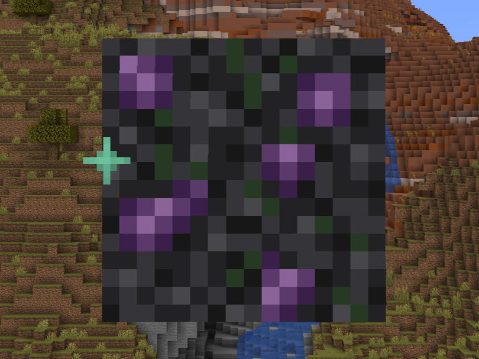
  <br>
  <em>Oxidized Bronze Ore generating in the world</em>
</p>

---

### 🔩 Ancient Gear
The primary crafting material for everything in this mod. Not craftable in a crafting table — obtained exclusively by smelting or blasting Oxidized Bronze Ore in any furnace.

<p align="center">
  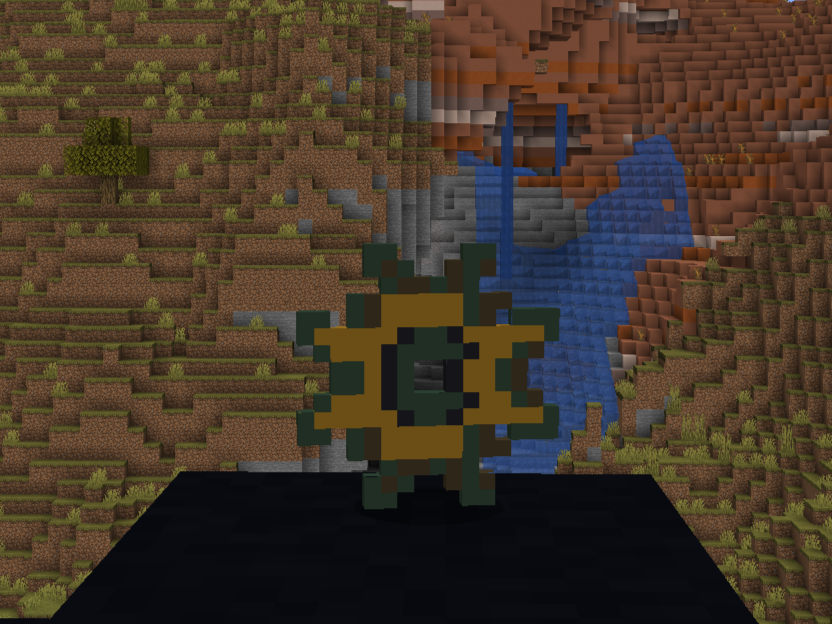
  <br>
  <em>The Ancient Gear component</em>
</p>

**Furnace / Blast Furnace:**
```
[ Oxidized Bronze Ore ]  →  Ancient Gear
```
<p align="center">
  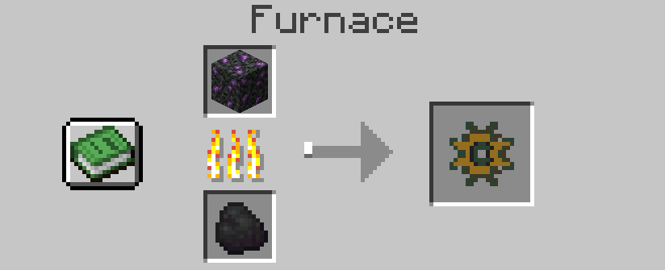
  <br>
  <em>Smelting process for the Ancient Gear</em>
</p>

---

### 💠 Antikythera Core
The central component that powers the ancient machinery. Also dropped by Talos when defeated.

<p align="center">
  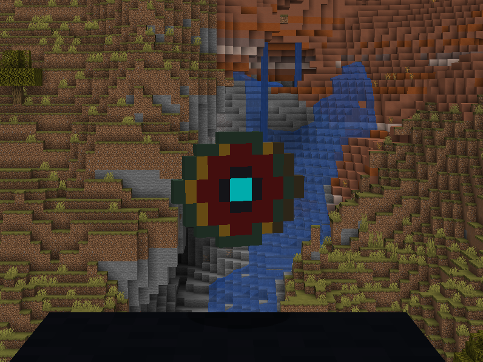
  <br>
  <em>The Antikythera Core</em>
</p>

**Crafting Table (cross):**
```
[ - ] [Gear] [ - ]
[Gear][RDST][Gear]
[ - ] [Gear] [ - ]
```
*(1 Redstone Block in the center, 4 Ancient Gears in a cross pattern)*

<p align="center">
  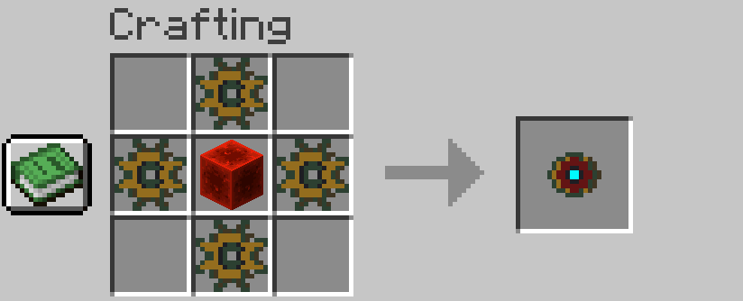
  <br>
  <em>Crafting recipe for the Antikythera Core</em>
</p>

---

### ⏱️ Chronos Dial
A custom interactive tool. When right-clicked, it freezes the movement of all surrounding mobs in a 10-block radius for 5 seconds by applying a Slowness II effect. It has a limited durability of **9 uses**. When its durability is depleted and the item breaks, it immediately summons Talos.

<p align="center">
  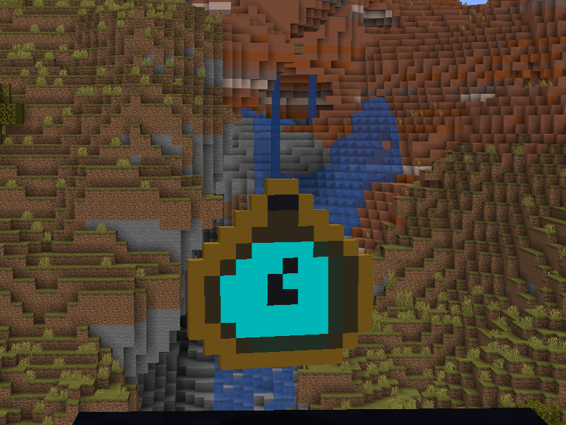
  <br>
  <em>The Chronos Dial tool</em>
</p>

**Crafting Table (surrounded):**
```
[Gear][Gear][Gear]
[Gear][CORE][Gear]
[Gear][Gear][Gear]
```
*(1 Antikythera Core in the center, 8 Ancient Gears filling all surrounding slots)*

<p align="center">
  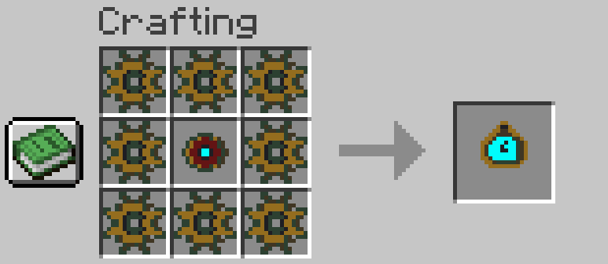
  <br>
  <em>Crafting recipe for the Chronos Dial</em>
</p>

<p align="center">
  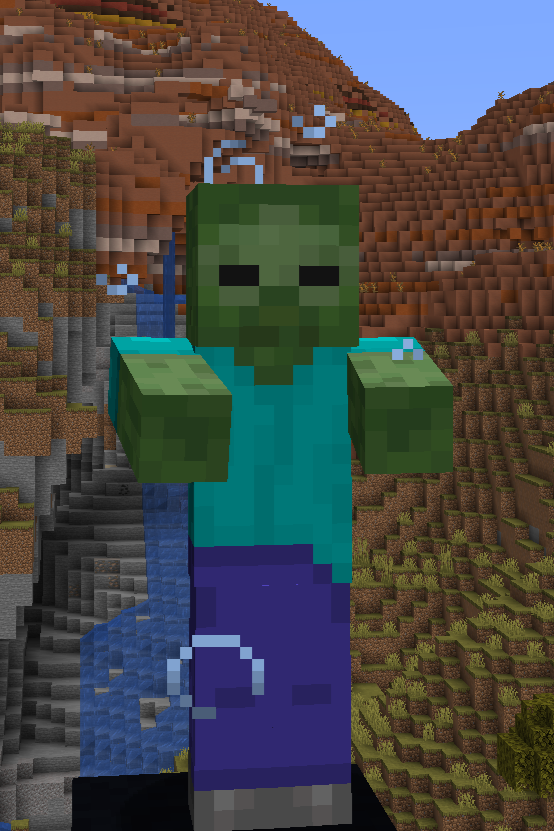
  <br>
  <em>Freezing nearby mobs using the Chronos Dial</em>
</p>

---

### 🧭 Celestial Tracker
A data-driven tracking tool. When right-clicked, it reads world data and displays an interactive coordinate message to the player. It has a durability of **4 uses**. Just like the Chronos Dial, if it breaks, Talos is summoned.

<p align="center">
  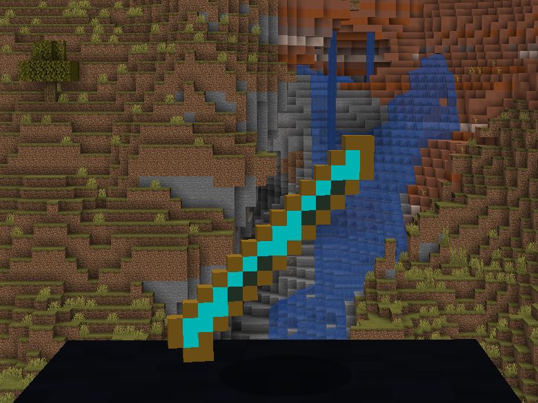
  <br>
  <em>The Celestial Tracker tool</em>
</p>

**Crafting Table (vertical line):**
```
[ - ] [Gear] [ - ]
[ - ] [CORE] [ - ]
[ - ] [Gear] [ - ]
```
*(1 Antikythera Core in the center, 1 Ancient Gear above and 1 below)*

<p align="center">
  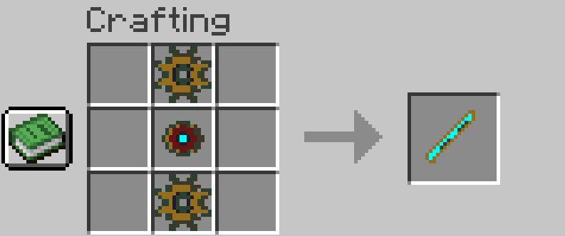
  <br>
  <em>Crafting recipe for the Celestial Tracker</em>
</p>

<p align="center">
  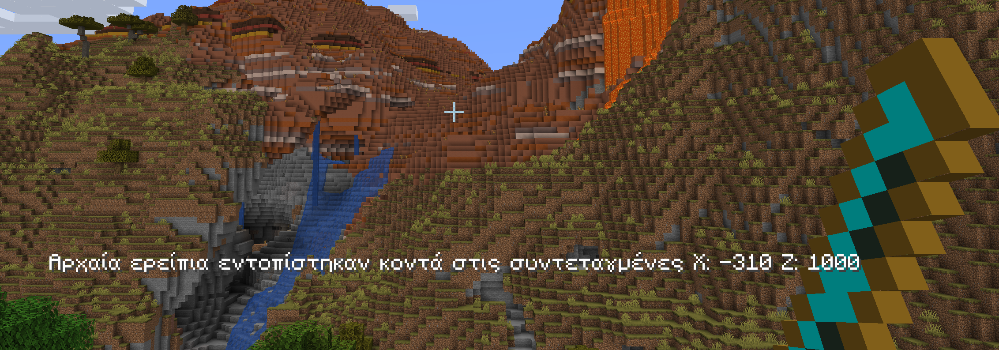
  <br>
  <em>Locating coordinates using the Celestial Tracker</em>
</p>

---


### 🤖 Talos

A custom mechanical mob made of rusted bronze, inspired directly by **Talos (Τάλως)** — the bronze giant of Greek mythology. According to legend, Talos was forged by the god Hephaestus and tasked with patrolling the shores of Crete three times a day, hurling boulders at unknown ships and burning intruders with his heated bronze body. He had a single divine vein of ichor running through him, sealed at the heel — the one vulnerability that Medea exploited to destroy him. The connection to the Antikythera Mechanism is fitting: ancient sources link Talos to solar worship and the cycles of time, the same forces the Mechanism was built to measure.

In this mod, that guardian lives again — awakened by the misuse of his creators' most powerful relics.

<p align="center">
  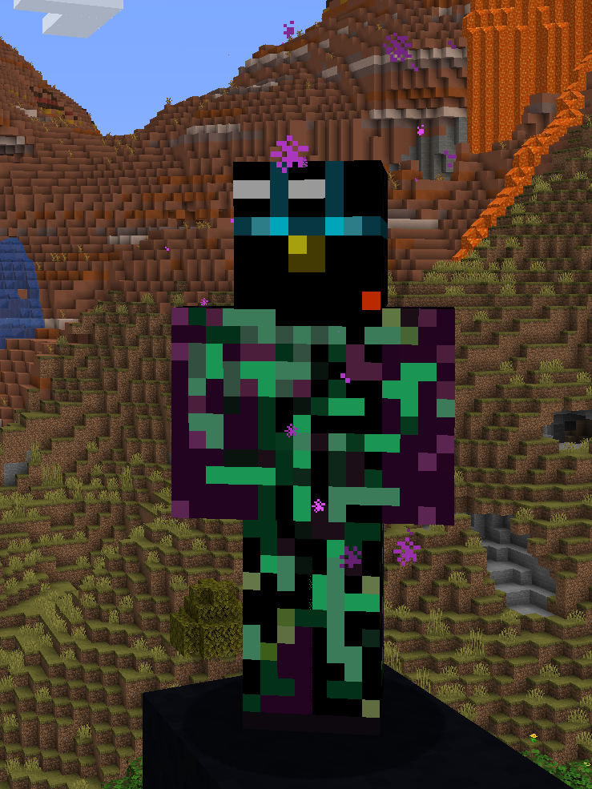
  <br>
  <em>The Talos automaton</em>
</p>

| Attribute | Value |
|---|---|
| Health | 60 HP |
| Movement Speed | 0.2 (slow and deliberate) |
| Attack Damage | 8 |
| On-Hit Effect | Sets target on fire for 5 seconds |
| Drops | Antikythera Core |

He moves slowly, emits custom metallic walking sounds, and features a fully custom 3D hierarchical model with realistic walking animations. He can swim and will not drown.

**Talos can be summoned in four ways:**

1. The **Chronos Dial** breaks from durability loss.
2. The **Celestial Tracker** breaks from durability loss.
3. **Building his body in the world** — place 4 Copper Blocks in a T-shape (like an Iron Golem), then place 1 Redstone Block on top as the head. The blocks vanish and Talos awakens.
4. Using the **Talos Spawn Egg** (Creative Mode only).

**World Building (T-shape):**
```
[ - ] [Redstone] [ - ]
[Copper] [Copper] [Copper]
[ - ] [Copper] [ - ]
```

(4 Copper Blocks in a T shape for the body, 1 Redstone Block placed last on top for the head)

---

## Credits

This project was developed by **George Karydis** under the challenge *"Engineer Your Adventure! Minecraft"* for the 2026 academic year at the Department of Informatics, Ionian University.

---

## License & Publicity Terms

This project and its accompanying media assets are licensed under the **Creative Commons Attribution-NonCommercial 4.0 International (CC BY-NC 4.0)** license.

In accordance with the GDPR disclaimer specified in the challenge announcement, results and uploaded media from this submission may be utilized in publicity and promotional activities by the Department of Informatics at the Ionian University.
